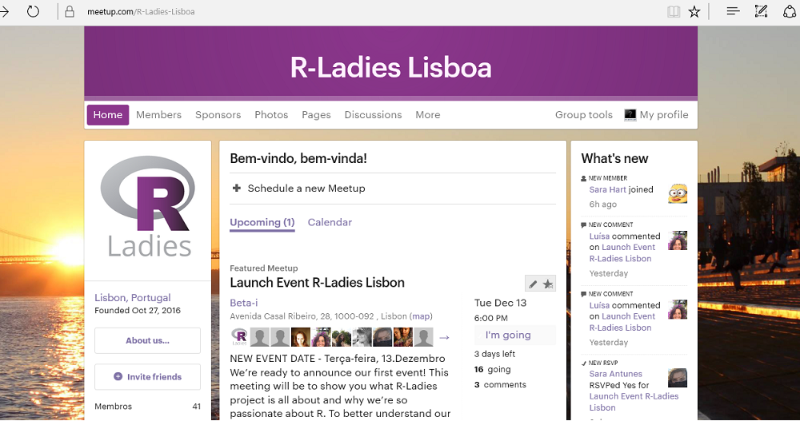

```{r packages, echo = FALSE, message=FALSE, eval = FALSE}
install.packages("devtools")
# Turn eval = TRUE, if you don't have 'devtools' installed
```


```{r install slidify, echo = FALSE, message=FALSE, eval = FALSE}
library(devtools)
install_github('ramnathv/slidify')
install_github('ramnathv/slidifyLibraries')
library(slidify)
```

<style> 
.title-slide {
  background-color: #88398A;
}

.title-slide hgroup > h1{
  font-family: 'Helvetica'; 'Open Sans'; 
  color: #FFFFFF;
}

.title-slide hgroup > h2 {
  font-family: 'Helvetica'; 'Open Sans';
  color: #FFFFFF  !important;
}

slide article h2, 
slide hgroup h2 {
  color: #88398A !important;
}


aside.gdbar {
  height: 120px;
  width: 315px;
  background: -webkit-gradient(linear, 0% 50%, 100% 50%, color-stop(0%, #ffffff), color-stop(100%, #ffffff)) no-repeat;
  background: -webkit-linear-gradient(left, #ffffff, #ffffff) no-repeat;
  background: -moz-linear-gradient(left, #ffffff, #ffffff) no-repeat;
  background: -o-linear-gradient(left, #ffffff, #ffffff) no-repeat;
  background: -ms-linear-gradient(left, #ffffff, #ffffff) no-repeat;
  background: linear-gradient(left, #ffffff, #ffffff) no-repeat;
}

aside.gdbar img {
  width: 275px;
  height: auto;
}


.fixed-carousel {
	position: absolute;
	left: 60px;
	bottom: 60px;
	right: 60px;
	top: 135px;
}

.fixed-carousel .carousel-inner, 
.fixed-carousel .item {
  background-color: #fff;
	width: 100%;
	height: 100%;
	
}

.fixed-carousel .item img {
  max-height: 100%;
  max-width: 100%;
  width: auto;
  height: auto;
  margin: 0 auto;
}

.fixed-carousel .item.wide img {
  width: 100%;
  max-height: none;
  position: absolute;
  top: -100%;
  left: 0;
  right: 0;
  bottom: -100%;
  margin: auto;
}

</style>

  
## Agenda de hoje

- Apresentação da comunidade R-Ladies
- A comunidade em Lisboa 
- Eventos futuros
- Exemplos de aplicação de R

- R e porquê R?
- Conversa, comida e bebidas :)

--- &vcenter

## Apresentação da comunidade R-Ladies 


**Gabriela de Queiroz** fundou R-Ladies São Francisco em Outubro de 2012

```{r Gabriela Queiroz, out.width = "400px", echo = FALSE}
knitr::include_graphics("assets/img/Gabriela_Queiroz.png")
```

--- &vcenter
## Missão 

### *"A World-Wide organization to promote gender diversity in the R community"*

---
## Objectivos


- Aumentar a participação de mulheres na comunidade de programação em R
- Encorajar mulheres a desenvolverem código em R, a criar "R packages" e a participarem activamente em conferências de R. 

--- &vcenter
## Situação actual


```{r global map, out.width = "800px", echo = FALSE}
knitr::include_graphics("assets/img/R_LadiesGlobal_map.jpg")
```

23 cidades iniciaram um grupo R-Ladies

https://twitter.com/RLadiesGlobal |
https://rladies.org

--- &vcenter
## R-Ladies Lisboa 


```{r meetup, out.width = "700px", echo = FALSE}

```

www.meetup.com/R-Ladies-Lisboa | https://github.com/rladieslx

www.twitter.com/RLadiesLx/ | www.facebook.com/groups/RLadiesLisboa

---
## Eventos futuros


* **R for begginers**
* **R - Real life examples**
* **R-Packages: Tidyverse, Dplyr**
* **R Markdown**
* **R-Shiny**
* **R e Python**
* **R e Webdevelopment (Javascript, HTML5, CSS)**
* **R e estatística**
* **R aplicado à Investigação**

--- &carousel-fixed
## Exemplos de R

*** {class: active, img: "assets/img/timeline.png"}
Timeline para organizar R-Ladies Lisboa

*** {img: "assets/img/beta-i Location.png"}
Mapa gerado através Leaflet https://rstudio.github.io/leaflet

*** {img: "assets/img/dplyr_example.png"}
Package dplyr to tidy up data

*** {img: "assets/img/shiny_datatable_example3.png"}
R Shiny with Chicken Data

*** {img: "assets/img/women_represent2.png"}
R's gender gap (from UseR conference)

*** {class: wide, img: "assets/img/bg_ponte.jpeg"}
Meetup! www.meetup.com/R-Ladies-Lisboa

--- &vcenter
## Exemplo: NetworkD3
```{r, 'networkD3', echo=FALSE,warning=FALSE,cache=FALSE,results='asis'}
cat('<iframe src="./assets/widgets/networkD3.html" width=100% height=100% allowtransparency="true" style="position:absolute;top:135px;bottom:60px;left:60px;right:60px;"></iframe>')
```


--- &vcenter 
## Agradecimentos

```{r r-ladies logo, out.width= '200px', echo = FALSE}
knitr::include_graphics("assets/img/R-LadiesGlobal_logo.png")
```


```{r ilustat logo, out.width = "200px", echo = FALSE}
knitr::include_graphics("assets/img/ilustat.png")
```

```{r ideia logo, out.width = "200px", echo = FALSE}
knitr::include_graphics("assets/img/logo_IDEIAhub.png")
```

```{r beta-i logo, out.width = "200px", echo = FALSE}
knitr::include_graphics("assets/img/logo_beta-i.png")
```

--- &vcenter 
## Contactos

lisboa@rladies.org


carolina@rladies.org


andreia@rladies.org
